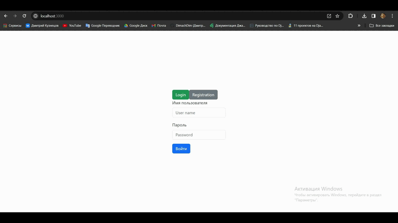
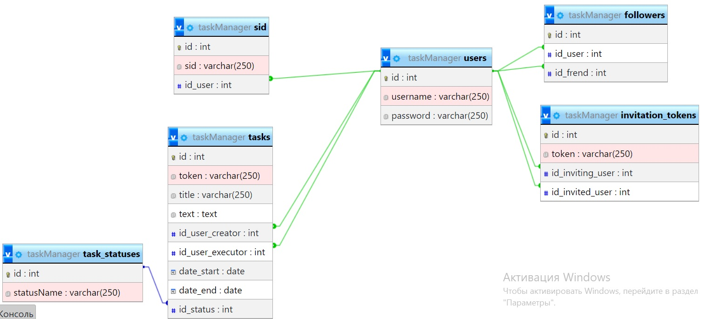

# backend-task-manager

## Видео

# Ссылки для api

## users
get: 'domain/users/get-info/(sid)' Получение информации о пользователе

get: 'domain/users/serch-name/(userName)' Получить пользователя по части имени (для поиска)

get: 'domain/users/get-invited/(id)' Получить приглашенныйх пользователе

## followers
get: 'domain/followers/yes-no/(userId)/(frendId) Получает текузего пользователя и второго. Сверяет подписаны они или нет

delete: 'domain/followers/(idRecord) Отписаться от пользователя

post: 'domain/followers  Подписаться на пользователя

get: 'domain/followers/get-my-subscriptions/(id) Получить пользователей на которых подписан

get: 'domain/followers/get-my-followers/(id) Получить пользователей которые подписаны на меня

## invite-tokens
post: 'domain/invite-tokens' Создание нового токена приглашения

## tasks
post: 'domain/tasks' Создание задачи

delete: 'domain/tasks/(id)' Удаление задачи

get: 'domain/tasks/my-tasks/(id)' Чтение задач созданных пользователем

get: 'domain/tasks/(id)' Чтение одной задачи

put: 'domain/tasks' Изменение записи

delete: 'domain/tasks/(id)' Удаление задачи

get: 'domain/tasks/pending-tasks/(id)' Чтение задач назначеных пользователю

# Архитектура базы данных

